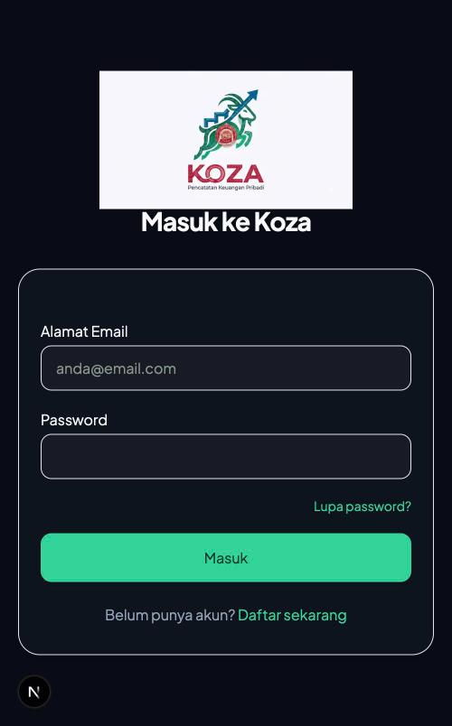
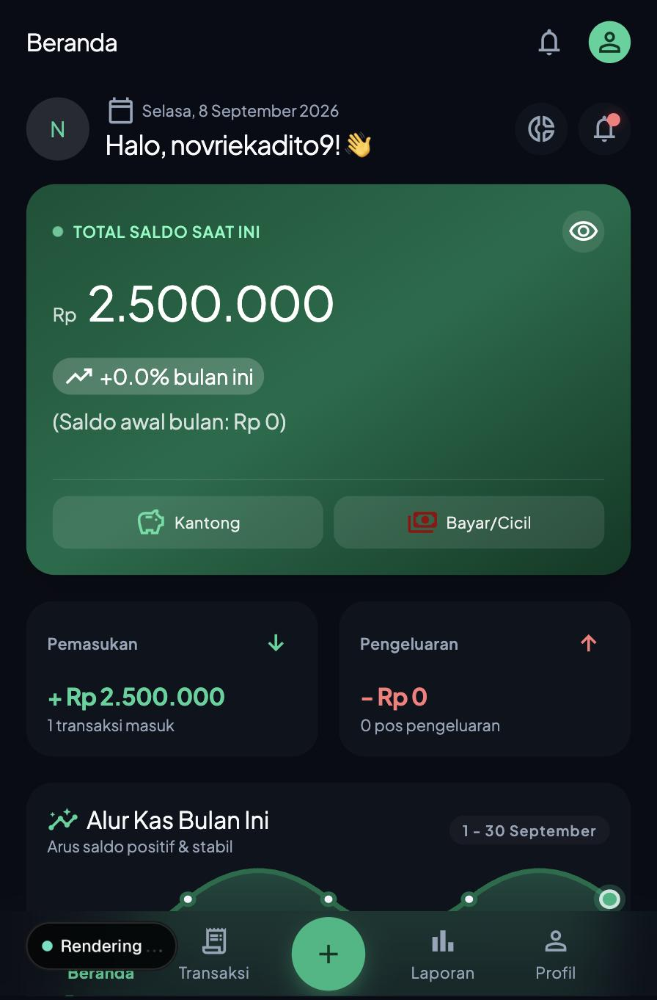
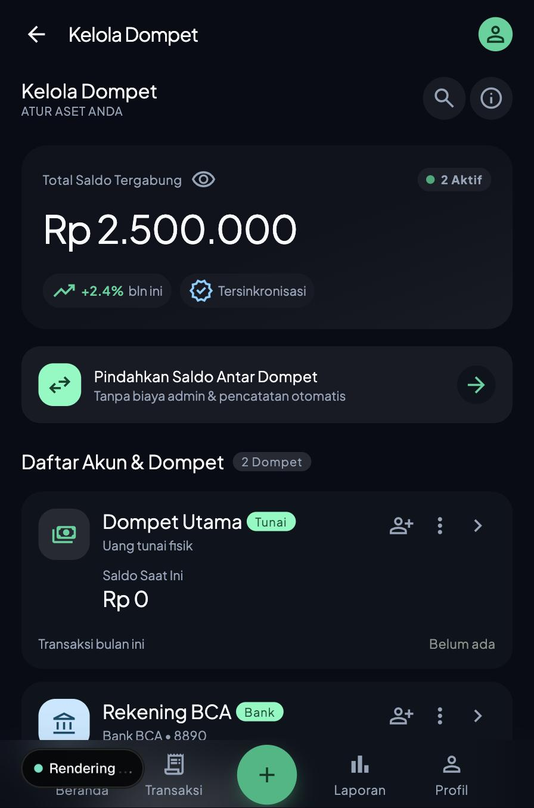
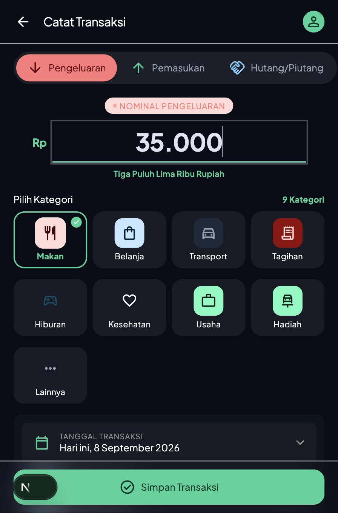
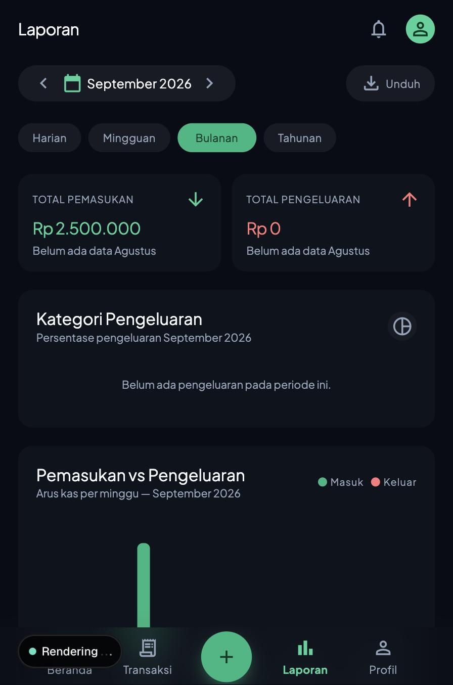

# Panduan Pengguna Koza

**Koza — Pencatatan Keuangan Pribadi**

Panduan ini akan membantu Anda memahami cara menggunakan aplikasi Koza dari awal: mendaftar akun, membuat dompet, mencatat transaksi, hingga membaca laporan keuangan Anda. Semua langkah di bawah ini disusun berdasarkan tampilan dan fitur yang benar-benar ada di aplikasi.

---

## Daftar Isi

1. [Pendaftaran & Masuk Aplikasi](#1-pendaftaran--masuk-aplikasi)
2. [Cara Membuat Dompet Baru](#2-cara-membuat-dompet--wallet-baru)
3. [Cara Mencatat Transaksi](#3-cara-mencatat-transaksi)
4. [Cara Membaca Dashboard & Laporan](#4-cara-membaca-dashboard--laporan)

---

## 1. Pendaftaran & Masuk Aplikasi

Koza menyimpan seluruh data keuangan Anda secara aman di server (bukan hanya di perangkat Anda), sehingga data tetap tersimpan meski Anda berganti perangkat. Karena itu, langkah pertama menggunakan Koza adalah membuat akun.

### 1.1 Membuat Akun Baru

1. Buka aplikasi Koza. Jika belum punya akun, tekan tautan **"Daftar sekarang"** di halaman masuk.
2. Isi formulir pendaftaran:
   - **Nama Lengkap** — nama yang akan tampil di aplikasi.
   - **Alamat Email** — digunakan untuk masuk dan verifikasi akun.
   - **Password** — minimal 6 karakter.
3. Tekan tombol **"Buat Akun"**.
4. Koza akan mengirimkan **tautan verifikasi** ke email Anda. Buka email tersebut dan klik tautannya untuk mengaktifkan akun.
5. Setelah email terverifikasi, Anda akan diarahkan kembali ke halaman masuk dengan pesan konfirmasi **"Email berhasil diverifikasi! Silakan masuk."**

> **Catatan:** Jika Anda lupa password, gunakan tautan **"Lupa password?"** di halaman masuk untuk mengatur ulang password lewat email.

### 1.2 Masuk ke Aplikasi

1. Di halaman **"Masuk ke Koza"**, isi **Alamat Email** dan **Password** Anda.
2. Tekan tombol **"Masuk"**.
3. Anda akan langsung diarahkan ke halaman **Beranda**.



Setelah berhasil masuk, aplikasi akan otomatis menyiapkan **satu dompet default ("Dompet Utama")** untuk Anda, sehingga Anda bisa langsung mulai mencatat transaksi tanpa harus membuat dompet secara manual terlebih dahulu — meskipun Anda tetap bisa menambah, mengganti nama, atau membuat dompet lain sesuai kebutuhan (lihat Bab 2).



---

## 2. Cara Membuat Dompet / Wallet Baru

"Dompet" di Koza mewakili tempat uang Anda berada secara nyata — baik itu rekening bank, uang tunai, maupun saldo e-wallet. Setiap transaksi yang Anda catat harus terhubung ke salah satu dompet ini agar saldo Anda tetap akurat.

### 2.1 Membuka Halaman Kelola Dompet

Tekan ikon **donut/target keuangan** di pojok kanan atas Beranda, atau navigasikan ke menu **Dompet**, untuk membuka halaman **"Kelola Dompet"**. Di sini Anda akan melihat:

- **Total Saldo Tergabung** — jumlah saldo dari semua dompet Anda.
- **Daftar Akun & Dompet** — daftar semua dompet yang sudah Anda buat, lengkap dengan tipe, saldo saat ini, dan ringkasan transaksi bulan berjalan.



### 2.2 Menambah Dompet Baru

1. Tekan tombol **"Tambah Dompet Baru"** di bagian bawah halaman.
2. Pilih **jenis dompet**:
   - **Bank** — untuk rekening bank (mis. BCA, Mandiri).
   - **Tunai** — untuk uang tunai fisik yang Anda pegang.
   - **E-Wallet** — untuk saldo dompet digital (mis. GoPay, OVO).
3. Isi data sesuai jenis yang dipilih:
   - **Nama dompet** — wajib diisi untuk semua jenis (mis. "Rekening Utama").
   - **Nama bank / Nama e-wallet** — muncul untuk jenis Bank atau E-Wallet (mis. "BCA" atau "GoPay").
   - **No. rekening** — hanya untuk jenis Bank, biasanya diisi dengan nomor yang disamarkan (mis. `****1234`).
   - **Saldo Awal** — jumlah uang yang sudah ada di dompet tersebut saat ini. Ketik angka biasa (mis. `2500000`); aplikasi otomatis memformatnya menjadi pemisah ribuan (`2.500.000`) saat Anda mengetik.
4. Tekan **"Simpan Dompet"**.

Dompet baru Anda akan langsung muncul di daftar, lengkap dengan label jenisnya (Bank/Tunai/E-Wallet) dan saldo awal yang tadi Anda masukkan.

> **Catatan penting:** Setelah dompet dibuat, kolom **Saldo Awal** tidak bisa diedit langsung lewat form. Ini disengaja — agar saldo dompet selalu presisi dan konsisten dengan riwayat transaksi Anda. Untuk mengubah saldo setelahnya, catat transaksi baru (pemasukan/pengeluaran) seperti dijelaskan di Bab 3.

### 2.3 Mengedit atau Menghapus Dompet

- Tekan ikon **titik tiga (⋮)** pada kartu dompet untuk membuka form edit. Di sini Anda bisa mengubah nama dompet, nama bank/e-wallet, dan nomor rekening.
- Untuk menghapus dompet, tekan **"Hapus Dompet"** di form edit. **Dompet yang masih memiliki riwayat transaksi tidak bisa dihapus** — Anda perlu menghapus atau memindahkan transaksinya terlebih dahulu.

### 2.4 Batasan Akun Gratis

Pengguna dengan paket **FREE** hanya bisa memiliki **maksimal 2 dompet**. Jika Anda mencoba menambah dompet ketiga, aplikasi akan menampilkan penawaran untuk meningkatkan ke paket **Premium**.

---

## 3. Cara Mencatat Transaksi

Ini adalah fitur inti Koza — setiap kali Anda menerima atau mengeluarkan uang, catat di sini agar laporan keuangan Anda selalu akurat.

### 3.1 Membuka Form Catat Transaksi

Tekan tombol **bulat hijau (+)** di tengah bawah layar — tombol ini selalu terlihat di halaman mana pun agar Anda bisa mencatat transaksi kapan saja.



### 3.2 Memilih Jenis Transaksi

Di bagian atas form, terdapat tiga pilihan tab:

| Tab | Kegunaan |
|---|---|
| **Pengeluaran** | Uang yang keluar dari dompet Anda (belanja, makan, tagihan, dll.) |
| **Pemasukan** | Uang yang masuk ke dompet Anda (gaji, bonus, hasil usaha, dll.) |
| **Hutang/Piutang** | Mencatat pinjaman — baik Anda yang berhutang (**Kasbon**) maupun Anda yang memberi pinjaman (**Piutang**) |

### 3.3 Mengisi Nominal

1. Ketuk area angka besar di tengah layar, lalu ketik nominalnya (mis. `35000`).
2. Aplikasi otomatis:
   - Memformat angka dengan pemisah ribuan saat Anda mengetik (`35.000`).
   - **Membersihkan input** — karakter selain angka otomatis diabaikan, jadi Anda tidak perlu khawatir salah ketik simbol.
   - Menampilkan **nominal dalam kata** di bawah angka (mis. "Tiga Puluh Lima Ribu Rupiah") sebagai konfirmasi visual bahwa nominal yang Anda ketik sudah benar.
3. Jika perlu mencatat transaksi dalam mata uang asing, ketuk simbol **"Rp"** di sebelah kiri angka untuk mengganti ke USD ($), EUR (€), atau SGD (S$) — nominal akan otomatis dikonversi ke Rupiah menggunakan kurs perkiraan saat disimpan.

### 3.4 Validasi Anti-Minus (Saldo Tidak Cukup)

Koza mencegah Anda mencatat pengeluaran yang melebihi saldo dompet yang dipilih. Jika nominal pengeluaran (atau piutang yang Anda berikan) lebih besar dari saldo yang tersedia, aplikasi akan menolak dan menampilkan pesan seperti:

> *"Saldo [Nama Dompet] tidak cukup — tersedia Rp [jumlah saldo]"*

Ini melindungi catatan Anda agar saldo dompet tidak pernah menjadi minus secara tidak sengaja. Selain itu, tombol **"Simpan Transaksi"** juga akan menolak nominal kosong atau nol — nominal transaksi wajib diisi lebih dari Rp 0 sebelum bisa disimpan.

### 3.5 Melengkapi Detail Transaksi

- **Pilih Kategori** — pilih kategori yang sesuai (Makan, Belanja, Transport, Gaji, Bonus, dll.). Kategori "Lainnya" selalu tersedia jika tidak ada yang cocok.
- **Tanggal Transaksi** — secara default terisi hari ini; ketuk untuk mengganti ke tanggal lain.
- **Sumber Rekening** — pilih dompet mana yang terpengaruh oleh transaksi ini. Jika Anda belum punya dompet sama sekali, aplikasi akan menampilkan tombol **"+ Buat Dompet Pertama"** yang langsung mengarahkan Anda ke Bab 2.
- **Catatan (opsional)** — tambahkan keterangan bebas, mis. "Makan siang dengan klien".

### 3.6 Mencatat Hutang / Piutang

Jika Anda memilih tab **Hutang/Piutang**:

1. Pilih **"Saya Berhutang (Kasbon)"** atau **"Memberi Hutang (Piutang)"**.
2. Isi **nama kontak** — wajib diisi (mis. nama orang yang meminjamkan atau meminjam uang).
3. Perhatikan efek otomatisnya:
   - **Kasbon** → uang pinjaman otomatis **menambah** saldo dompet Anda.
   - **Piutang** → uang yang Anda pinjamkan otomatis **mengurangi** saldo dompet Anda.

### 3.7 Menyimpan Transaksi

Tekan **"Simpan Transaksi"**. Setelah tersimpan, Anda akan melihat animasi konfirmasi **"Tersimpan Rapi!"** sebelum diarahkan kembali. Saldo dompet terkait akan otomatis diperbarui.

> **Catatan:** Saat ini Koza belum memiliki fitur transfer saldo langsung antar dompet dalam satu langkah — untuk memindahkan dana antar dompet, catat sebagai dua transaksi terpisah (Pengeluaran dari dompet asal, Pemasukan ke dompet tujuan).

---

## 4. Cara Membaca Dashboard & Laporan

### 4.1 Beranda — Ringkasan Sekilas

Halaman Beranda dirancang untuk memberi gambaran cepat kondisi keuangan Anda hari ini:

- **Kartu Total Saldo** (hijau, di bagian atas) — menjumlahkan saldo dari seluruh dompet Anda. Tekan ikon mata (👁) untuk menyembunyikan/menampilkan angka saldo jika Anda sedang di tempat umum.
  - Di bawah angka saldo, ada persentase perubahan saldo bulan ini dibanding saldo awal bulan.
- **Kartu Pemasukan & Pengeluaran** — ringkasan total pemasukan dan pengeluaran bulan berjalan, beserta jumlah transaksinya.
- **Grafik "Alur Kas Bulan Ini"** — grafik garis (SVG) yang menunjukkan tren saldo Anda per minggu (Minggu 1–4) sepanjang bulan berjalan. Garis naik berarti saldo bertambah; garis turun berarti saldo berkurang.
- **Skor Kesehatan Keuangan** — skor 0–100 yang dihitung dari pola transaksi Anda, lengkap dengan tips singkat. Tekan **"Analisis"** untuk detail lebih lanjut.
- **Transaksi Terakhir** — 3 transaksi paling baru; tekan **"Lihat Semua"** untuk membuka riwayat lengkap.


### 4.2 Laporan — Analisis Mendalam

Buka menu **Laporan** dari navigasi bawah untuk melihat analisis yang lebih rinci.



**Memilih Periode:**

- Gunakan tombol panah (`<` `>`) di bagian atas untuk berpindah ke periode sebelumnya/berikutnya.
- Pilih rentang waktu lewat filter: **Harian**, **Mingguan**, **Bulanan**, atau **Tahunan**.

**Membaca Kartu Ringkasan:**

- **Total Pemasukan** dan **Total Pengeluaran** — masing-masing menampilkan perbandingan persentase terhadap periode sebelumnya (mis. "+12% dari bulan lalu").

**Membaca Grafik Donat "Kategori Pengeluaran":**

- Diagram donat menunjukkan proporsi pengeluaran Anda per kategori pada periode terpilih.
- Di bawah diagram, ada daftar kategori dengan warna, persentase, dan nominalnya masing-masing.
- Kategori dengan porsi terbesar akan ditampilkan lebih menonjol; kategori kecil lainnya digabung sebagai "Lainnya".

**Membaca Grafik Batang "Pemasukan vs Pengeluaran":**

- Grafik batang ganda membandingkan arus masuk (hijau) dan arus keluar (merah) per sub-periode (per minggu untuk tampilan bulanan, per bulan untuk tampilan tahunan, dst.).
- Di bawah grafik, ada ringkasan **"Selisih Kas Bersih"** — selisih antara total pemasukan dan pengeluaran periode tersebut.

**Rincian Pengeluaran:**

- Daftar kategori pengeluaran diurutkan dari yang terbesar, lengkap dengan jumlah transaksi dan bar persentase per kategori.

**Mengunduh Laporan:**

- Tekan tombol **"Unduh"** di bagian atas untuk mengekspor data transaksi periode tersebut ke file CSV.
- Pengguna **FREE** dibatasi hingga **3 kali unduhan**; setelah kuota habis, tombol akan berubah menjadi ikon kunci dan menawarkan peningkatan ke Premium.

---

## Ringkasan Alur Penggunaan

```
Daftar Akun → Verifikasi Email → Masuk
        ↓
  (Dompet default sudah dibuat otomatis)
        ↓
   Buat/Sesuaikan Dompet (Bab 2)
        ↓
   Catat Transaksi Harian (Bab 3)
        ↓
   Pantau di Beranda & Laporan (Bab 4)
```

Selamat menggunakan Koza — semoga catatan keuangan Anda semakin rapi dan terkendali!
